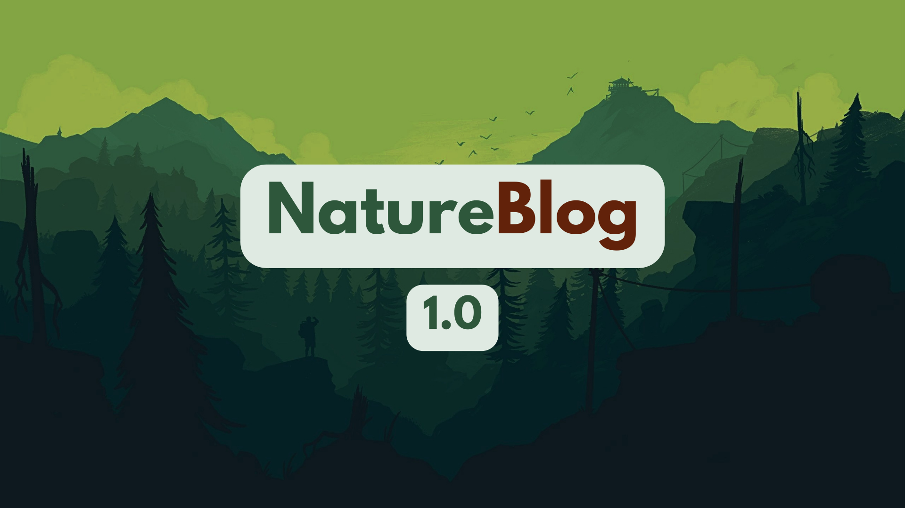
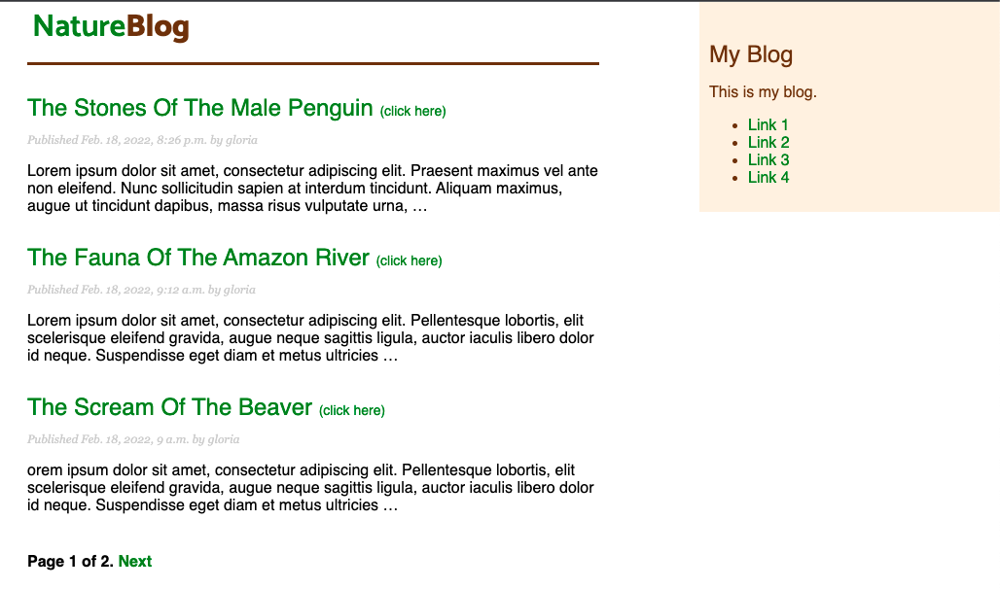

# NatureBlog 1.0 - Django Blog Application

This is a Blog Web Application, written in <strong>Django 3</strong>. 

<strong>This application allows the creation and publication of posts</strong>. The posts are listed in the main layout, and it's possible to see the Title, the Published Date, and a small part of their Text Content. By clicking on the Post's Link you are interested in, you can see all of its content.

 ## Table Of Contents

 * General Info
 * Technologies
 * Setup
 * Status
 
 ## General Info
 

 ## Technologies Used

  ### Languages Used

  * [Python3](https://en.wikipedia.org/wiki/Python_(programming_language))
  * [HTML5](https://en.wikipedia.org/wiki/HTML5)
  * [CSS3](https://en.wikipedia.org/wiki/CSS#CSS_3)
  * [SQLite](https://en.wikipedia.org/wiki/SQLite)

  ### Frameworks, Libraries & Programs Used

  1. [Django3](https://en.wikipedia.org/wiki/Django_(web_framework))
  2. [SASS](https://en.wikipedia.org/wiki/Sass_(stylesheet_language))
  3. [Google Fonts](https://en.wikipedia.org/wiki/Google_Fonts)
  4. [Git](https://en.wikipedia.org/wiki/Git)
  5. [GitHub](https://en.wikipedia.org/wiki/GitHub)

